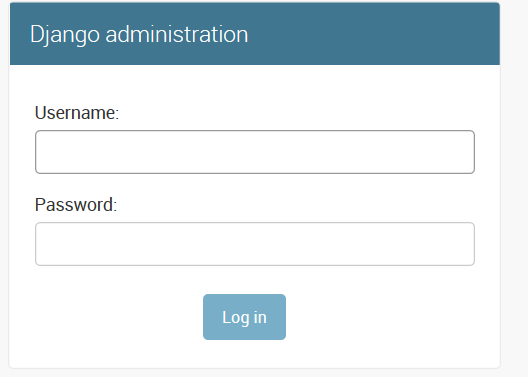
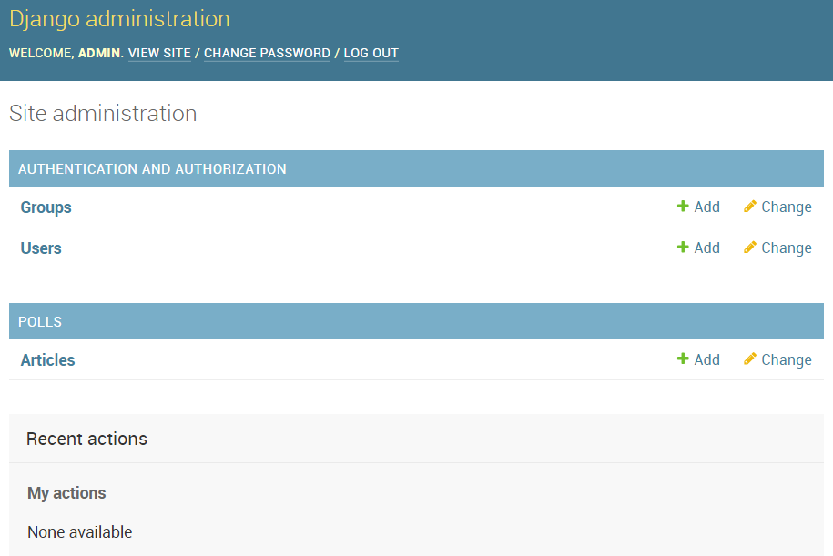
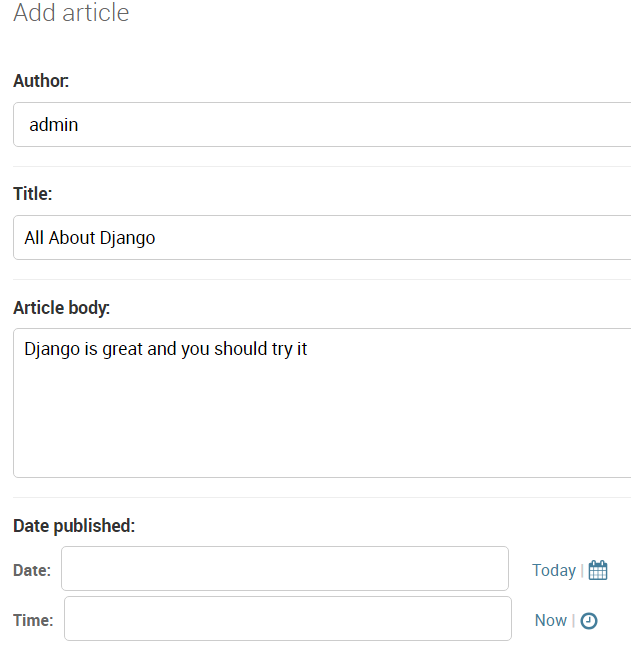

#### Author: [Kim Rock](https://github.com/lumosNox9)

Django is an open-source web framework for Python that simplifies some of the most tedious parts of getting a website up and running. My favorite part about Django is the ease of creating admin pages to view and edit tables in the database.

You don't need to know much about Django to enjoy this blog post, but if you're interested in learning more, check out [the official documentation and tutorial here.](https://docs.djangoproject.com/en/2.1/intro/tutorial01/) 

Django makes it easy to create a database for your website. The python code for a table that holds news articles could look like this:

```
from django.db import models

class Article(models.Model):
    author = models.ForeignKey('auth.User', on_delete=models.CASCADE)
    title = models.CharField(max_length=200)
    article_body = models.TextField()
    pub_date = models.DateTimeField('date published') 
```
Django will take that text and make it into a database table in SQLite (it also has the ability to use other backends, [more info here](https://docs.djangoproject.com/en/2.1/topics/install/#database-installation)).

To create the admin site, all you need to do is add these lines to your admin.py, a file with Django creates automatically:

```
from django.contrib import admin
from .models import Article

admin.site.register(Article)
```

The final step is to create a superuser in your Python console that will allow you to login to your admin site.

```
python manage.py createsuperuser
```
This will prompt you to setup a username and password.

Now, behold the payoff. We've just creatated an admin site that lets you log in, create/edit other logins, and view and modify your database table.

The admin log-in prompt is automatically created.



An interface to add/edit users and articles, as well as the logout functionality.



All the fields in our Article table are shown here with user-friendly niceties such as the date picker and today/now shortcuts.



That's so easy!

To learn more about Django, check out [the official documentation and tutorial here.](https://docs.djangoproject.com/en/2.1/intro/tutorial01/) 

I also recommend this beginner-friendly [tutorial from Django Girls.](https://tutorial.djangogirls.org/en/django_admin/) 
     
-- [Kim](https://github.com/lumosNox9)
